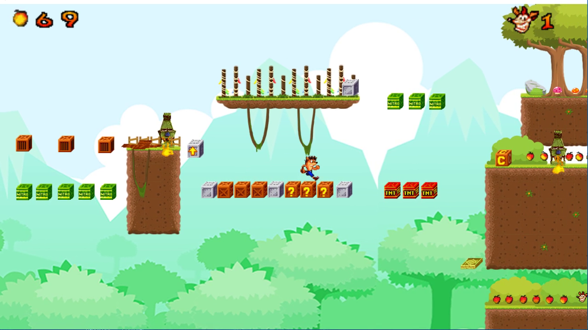

# Crash-Bandicoot-2D

About the game
===========
Crash Bandicoot 2D is a videogame developed independently during the first year of game programming at AIV. It was developed entirely in C#, using a small game engine developed during the academic year. I used game programming techniques studied and acquired gradually during the year to develop it (raycasting, FSM, GPU acceleration hardware, etc ....). The entire game level was made with Tiled and imported into Visual Studio via an XML file.
